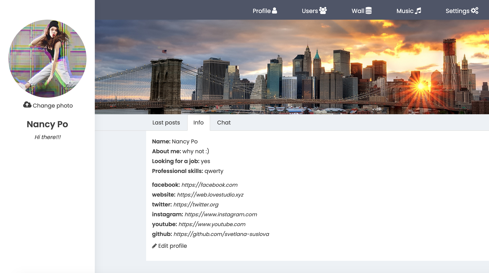

# Demo:
Live demo is unavailable, because of the app's server restrictions.

#

# Locally:
But you can download the app and run it locally (please select master branch).
In the project directory:

### `npm i`

### `npm start`

Open [http://localhost:3000](http://localhost:3000) to view it in the browser.

# Credentials to eneter the app:
<ul>
  <li>email: samurajcredentials@gmail.com</li>
  <li>password: localAPIaccess</li>
</ul>

# Used technologies and libraries:
<ul>
  <li>Create React App</li>
  <li>React</li>
  <li>ES6</li>
  <li>AJAX</li>
  <li>axios</li>
  <li>react-router-dom</li>
  <li>Redux</li>
  <li>redux-thunk</li>
  <li>React Hooks</li>
  <li>redux-form</li>
  <li>reactstrap</li>
  <li>styled-components</li>
  <li>classnames</li>
</ul>
